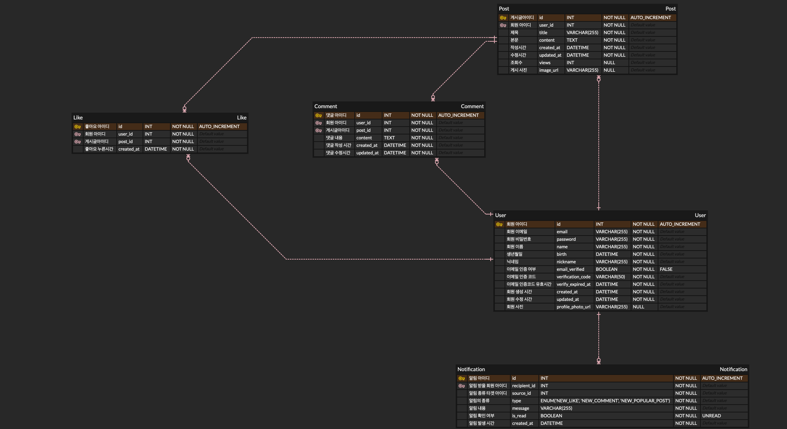

# PostPulse

> 실시간 인기 게시글 트렌드 커뮤니티 플랫폼

---

## 목차
1. [프로젝트 개요](#프로젝트-개요)  
2. [선정 배경](#선정-배경)  
3. [기술 스택](#기술-스택)  
4. [ERD (Entity–Relationship Diagram)](#erd-entity–relationship-diagram)    
5. [라이브 데모](#라이브-데모)
6. [구현 기능 상세](구현-기능-상세)  
7. [API 엔드포인트 정리](#API-엔드포인트-정리)  

---

## 프로젝트 개요
“**PostPulse**”는 Kafka 기반의 이벤트 스트리밍과 Redis 캐시를 활용해, 게시글에 대한 사용자 반응(조회·좋아요·댓글)을 실시간으로 집계·분석하여 즉시 인기 순위를 제공하는 백엔드 중심 커뮤니티 플랫폼입니다.

## 선정 배경

이 프로젝트는 실시간으로 변화하는 온라인 커뮤니티의 사용자 관심도를 즉시 포착해 제공하는 커뮤니티 플랫폼입니다.
일반적인 서비스들은 일정 주기(예: 주,일) 단위로 인기 게시글을 집계하지만, 사용자가 체감하는 트렌드는 분 단위로도 급변하기 때문에 실시간 반영이 중요하다고 판단했습니다.이런 배경에서 “PostPulse”는
`이벤트 스트리밍(Kafka) → 실시간 집계(Redis) → 간편 조회(API)`
의 구조로 설계되어, 사용자 행동(조회·좋아요·댓글)을 즉시 인기 순위로 전환해 제공함으로써 플랫폼 사용성을 크게 향상시키는 것을 목표로 삼았습니다.

- **실시간 스트리밍 & 캐시 기술 경험**  
  Kafka로 대용량 이벤트를 비동기로 수집하고, Redis Sorted Set에 즉시 반영하는 구조를 직접 구현해보고 싶었습니다.  
- **분산 메시징 아키텍처 학습**  
  이벤트 드리븐 설계가 실제 서비스 퍼포먼스에 어떤 이점을 주는지 확인하고, 백엔드 설계 역량을 키우기 위해 선택했습니다.  
- **엔드투엔드 실습**  
  인증→이벤트 수집→실시간 집계→API 서빙까지 전체 플로우를 Docker·AWS 환경에 배포하며 엔드투엔드 경험을 쌓고자 했습니다.

---

## 기술 스택
- **언어·프레임워크**: Java 21, Spring Boot 3.4.4  
- **인증**: JWT 토큰 + `@WebFilter` 기반 검증  
- **이메일**: Mailgun API (OpenFeign 연동)  
- **DB & ORM**: MySQL, JPA (Hibernate)  
- **검색**: Elasticsearch (Spring Data Elasticsearch)  
- **메시징**: Apache Kafka + ZooKeeper  
- **캐시**: Redis (Sorted Set / Pub/Sub)  
- **도커화**: Docker & Docker Compose  
- **배포 인프라**: AWS EC2 (m5.large), Elastic IP, 30 GiB gp3 EBS  
- **API 문서화**: Swagger UI (springdoc-openapi)  

---

## ERD (Entity–Relationship Diagram)
 
User, Post, Comment, Like, Notification 테이블의 ERD입니다.

---

## 배포 URL

- **서비스 베이스 URL**:  
  `http://43.200.216.28/`

- **Swagger UI**:  
  `http://43.200.216.28/swagger-ui/index.html`

---

## 구현 기능 상세 

### 회원 관리
- [x] 회원가입 (이메일 인증 - Mailgun, OpenFeign 활용)
- [x] 로그인 (JWT 인증 및 Spring Security 적용)
- [x] 회원 정보 수정 및 탈퇴

### 게시글 관리
- [x] 게시글 작성 / 수정 / 삭제
- [x] 게시글 목록 조회 (최신순)
- [x] 게시글 상세 조회

### 댓글 및 좋아요 기능
- [x] 게시글에 대한 댓글 작성, 수정, 삭제
- [x] 좋아요 등록 및 취소
- [x] 댓글 및 좋아요 수 실시간 반영

### 알림 기능
 - [X] 사용자의 게시글에 댓글이 달릴 경우 알림 발송
 - [x] 사용자의 게시글에 좋아요가 눌릴 경우 알림 발송
 - [x] Kafka를 활용하여 비동기 알림 이벤트 처리
 - [x] Redis Pub/Sub을 이용한 실시간 알림 처리
 - [x] 사용자가 알림 목록을 조회할 수 있도록 API 제공

### 게시글 검색 기능
- [x] 게시글 제목 또는 사용자가 입력한 부분 문자열로 제목에 포함된 게시글을 검색
- [x] 검색 결과가 많을 경우 페이징 처리하여 사용자에게 제공

### 실시간 인기 게시글 (Kafka + Redis 활용)
- [x] 게시글 인기 점수 계산 (조회수 = 1점, 좋아요 = 5점, 댓글 = 3점), (동일 유저가 중복 조회해도 조회수는 증가하지 않도록 처리)
- [x] Kafka를 활용하여 조회 이벤트 수집
- [x] Redis SortedSet을 이용한 실시간 인기 게시글 반영
- [x] 인기 게시글 피드 제공

---

## API 엔드포인트 정리

| Controller                     | Method | Path                                     | Description                         |
|--------------------------------|--------|------------------------------------------|-------------------------------------|
| **Sign-Up**                    | POST   | `/signup/user`                           | 이메일 인증 링크 발송 및 회원가입      |
|                                | GET    | `/signup/user/verify?email=&code=`       | 이메일 인증 처리                    |
| **Sign-In**                    | POST   | `/signin/user`                           | 사용자 로그인 (JWT 발급)             |
| **User-Profile**               | POST   | `/user/profile/photo`                    | 프로필 사진 업로드 (S3)             |
| **Post**                       | POST   | `/user/post/create`                      | 게시글 작성                         |
|                                | PUT    | `/user/post/update/{id}`                 | 게시글 수정                         |
|                                | GET    | `/user/post/{id}`                        | 게시글 상세 조회                    |
|                                | GET    | `/user/post/list`                        | 게시글 목록 조회 (최신순·페이징)    |
|                                | DELETE | `/user/post/delete/{id}`                 | 게시글 삭제                         |
| **Comment**                    | POST   | `/user/post/{postId}/comment`            | 댓글 작성                           |
|                                | GET    | `/user/post/{postId}/comment`            | 댓글 목록 조회                      |
|                                | PUT    | `/user/post/{postId}/comment/{commentId}`| 댓글 수정                           |
|                                | DELETE | `/user/post/{postId}/comment/{commentId}`| 댓글 삭제                           |
| **Like**                       | POST   | `/user/post/{postId}/like`               | 좋아요 등록                         |
|                                | DELETE | `/user/post/{postId}/like`               | 좋아요 취소                         |
| **Search**                     | GET    | `/user/post/search?keyword={keyword}`    | 게시글 검색 (Elasticsearch)         |
| **Popular-Post**               | GET    | `/api/posts/popular`                     | 인기 게시글 Top-N 조회              |
| **Notification**               | GET    | `/api/notifications`                     | 알림 목록 조회                      |
|                                | POST   | `/api/notifications/{id}/read`           | 특정 알림 읽음 처리                |
| **Notification-SSE**           | GET    | `/api/notifications/stream`              | 실시간 알림 스트리밍 (SSE)          |

---

